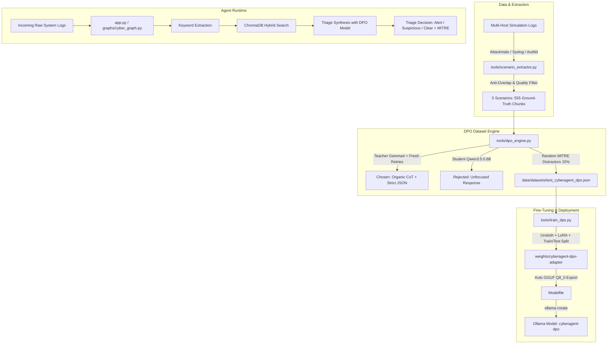

# 🛡️ CyberAgent: Autonomous SOC Triage Agent with RAG & DPO Fine-Tuning

[](https://www.python.org/)
[](https://github.com/langchain-ai/langgraph)
[](https://github.com/unslothai/unsloth)
[](https://attack.mitre.org/)
[](LICENSE)

**CyberAgent** is an autonomous Security Operations Center (SOC) triage and incident analysis engine. It combines:
1. **Hybrid RAG** over MITRE ATT&CK Enterprise techniques via ChromaDB.
2. **Deterministic State-Graph Orchestration** powered by LangGraph.
3. **Organic Chain-of-Thought (`<think>`) Reasoning** with strict JSON schemas.
4. **Direct Preference Optimization (DPO)** pipeline to train small local student models (e.g., `Qwen3.5-0.8B`) into high-performance SOC triage specialists.

---

## 🏛️ System Architecture



---

## 📁 Repository Structure

```text
CyberAgent/
├── app.py                          # Main CLI entrypoint for triage analysis & DPO runs
├── config/
│   ├── config.yaml                 # LLM provider configurations, models, and paths
│   └── llm_factory.py              # LLM factory (Ollama, Gemini, LangChain)
├── data/
│   ├── chroma_mitre_db/            # Persisted ChromaDB MITRE ATT&CK vector store
│   ├── datasets/                   # Generated DPO and SFT JSON datasets
│   └── logs_training_data/         # Multi-host scenario logs & ground truth files
│       ├── SCENARIO_README.md      # Detailed breakdown of all 5 simulation scenarios
│       ├── scenario_2_cron/        # Scenario 2.1 raw logs
│       ├── scenario_2_rootkit/     # Scenario 2.2 raw logs
│       ├── scenario_3_ssh_apt/     # Scenario 3.1 raw logs
│       ├── scenario_3_vnc_puppet/  # Scenario 3.2 raw logs
│       └── scenario4/              # Scenario 4.1 raw logs
├── graphs/
│   ├── cyber_graph.py              # LangGraph state-machine definition
│   └── state.py                    # Graph state typing and definitions
├── models/
│   └── schemas.py                  # Pydantic schemas for structured triage results
├── tests/
│   ├── test_logs/                  # Benchmark test logs (easy/hard TP & TN)
│   ├── test_agent.py               # Unit and integration tests for graph triage
│   └── test_rag.py                 # RAG retrieval and ChromaDB tests
├── tools/
│   ├── dpo_engine.py               # DPO dataset generator (Chosen / Rejected)
│   ├── scenario_extractor.py       # Automated scenario parser & anti-overlap extractor
│   ├── train_dpo.py                # Unsloth + LoRA DPO trainer with GGUF export
│   ├── retrieve_mitre.py           # MITRE ATT&CK database loader & indexer
│   ├── vector_store.py             # ChromaDB vector store manager (hybrid search)
│   └── utils.py                    # LLM response parser (CoT <think> + JSON)
├── weights/                        # Exported LoRA adapters, GGUFs, and Modelfiles
├── requirements.txt                # Core project dependencies
└── README.md                       # This documentation
```

---

## 🚀 Quickstart & Setup

### 1. Environment Setup

```bash
# Clone the repository
git clone https://github.com/your-username/CyberAgent.git
cd CyberAgent

# Create and activate virtual environment
python3 -m venv CyberAgentEnv
source CyberAgentEnv/bin/activate

# Install dependencies
pip install -r requirements.txt
pip install unsloth trl peft transformers datasets accelerate bitsandbytes
```

### 2. Configure Models (`config/config.yaml`)

```yaml
llms:
  good:
    provider: "ollama"
    model: "gemma4"          # Teacher model for 'chosen' responses
  bad:
    provider: "ollama"
    model: "qwen3.5:0.8b"    # Student model for 'rejected' responses
  synthesizer:
    provider: "ollama"
    model: "qwen3.5:0.8b"    # Active triage model

embeddings:
  provider: "ollama"
  model: "nomic-embed-text"

vector_store:
  persist_directory: "./data/chroma_mitre_db"
  collection_name: "mitre_knowledge_base"
```

---

## 🕹️ CLI Command Reference & Cheat Sheet

### 1. Extract Atomic Chunks from Simulation Scenarios

Extracts structured logs, separates dual-use commands from offensive payloads, and applies strict anti-overlap negative filtering:

```bash
# Example: Extracting Scenario 2 Cron
python3 tools/scenario_extractor.py \
  --scenario_dir data/logs_training_data/scenario_2_cron \
  --output_dir data/logs_training_data/scenario2_cron_auto \
  --max_per_intent 5
```

### 2. Generate Paired DPO / SFT Dataset (`prompt`, `chosen`, `rejected`)

Evaluates all scenario chunks with the Teacher model, applies fresh retry validation, injects RAG distractors (15%), and records Student non-preferred answers:

```bash
python3 tools/dpo_engine.py \
  --input data/logs_training_data \
  --output data/datasets/cyberagent_dpo_full.json \
  --distractor-ratio 0.15 \
  --max-retries 2 \
  --resume \
  --phase all
```

*Key flags:*
* `--phase all` : Runs Phase 1 (Chosen) + Phase 2 (Rejected).
* `--resume` : Automatically resumes from existing entries without recomputing.
* `--max-retries 2` : Single-turn fresh retries to guarantee 100% organic `<think>` reasoning.

### 3. Fine-Tune Student Model with DPO (Unsloth + LoRA)

Trains the student model using Unsloth acceleration, evaluates on a 10% test split, and exports a `Q8_0` GGUF:

```bash
python3 tools/train_dpo.py \
  --dataset data/datasets/test_cyberagent_dpo.json \
  --model unsloth/Qwen3.5-0.8B \
  --output weights/cyberagent-dpo-qwen3.5-0.8b \
  --lora-rank 16 \
  --lora-alpha 32 \
  --beta 0.1 \
  --eval-split 0.1 \
  --lr 5e-6 \
  --epochs 3 \
  --export-gguf q8_0
```

*Leave-One-Scenario-Out variant (e.g. holding out `scenario4_auto` entirely for test):*
```bash
python3 tools/train_dpo.py \
  --dataset data/datasets/test_cyberagent_dpo.json \
  --exclude-scenarios scenario4_auto \
  --output weights/cyberagent-dpo-qwen3.5-0.8b
```

### 4. Deploy Fine-Tuned Model into Ollama

```bash
ollama create cyberagent-dpo -f weights/cyberagent-dpo-qwen3.5-0.8b/Modelfile
```

### 5. Evaluate & Benchmark SOC Performance

Run full benchmark evaluation with confusion matrix, false positive rates, and MITRE accuracy:

```bash
# Evaluate against exported validation set
python3 tools/eval_benchmark.py \
  --model cyberagent-dpo \
  --eval-file weights/cyberagent-dpo-qwen3.5-0.8b/eval_dataset.json

# OR evaluate against a full unseen scenario (e.g. Scenario 4)
python3 tools/eval_benchmark.py \
  --model cyberagent-dpo \
  --scenario data/logs_training_data/scenario4_auto
```

### 6. Run the Autonomous SOC Triage Agent

Run real-time analysis against raw log files or full directories:

```bash
# Analyze a specific log file
python3 app.py --logs tests/test_logs/logs_1-hardTP.log -v

# Analyze an entire directory of logs
python3 app.py --logs tests/test_logs/ -v
```

### 7. Run Unit & Benchmark Tests

```bash
pytest tests/ -v
```

---

## 📊 Dataset Benchmark Summary

| Scenario Name | Offensive (Alert) | Suspicious | Benign (Clear) | Total Chunks | Attack Vector & Highlights |
| :--- | :---: | :---: | :---: | :---: | :--- |
| **`scenario_2_cron`** | 6 | 37 | 66 | **109** | ZoneMinder exploit, Sliver C2, cron persistence, shadow hash dumping |
| **`scenario_2_rootkit`** | 6 | 37 | 67 | **110** | Stealth rootkit module (`selinux.so.3`), rsync exfiltration, log wiping |
| **`scenario_3_ssh_apt`** | 15 | 31 | 70 | **116** | SSH pivot -> CA key theft -> Debian package poisoning (`.deb`) -> Ransomware |
| **`scenario_3_vnc_puppet`**| 7 | 30 | 69 | **106** | VNC brute force -> Puppet code injection -> Lateral movement |
| **`scenario4`** | 9 | 29 | 76 | **114** | Port knocking -> Systemd disguise -> Shorewall firewall bypass -> LAN pivot |
| **TOTAL** | **43 (8%)** | **164 (30%)** | **348 (62%)** | **555 Chunks** | **Balanced 1025 DPO Pairs (Quality Filtered)** |

---

## 🧠 Chain-of-Thought `<think>` & JSON Output Schema

Every triage prediction is structured in two parts:

```text
<think>
1. log_source: syslog / sudo on web-prod
2. target_entities: user=www-data, binary=sudo/bash, socket=/dev/tcp/198.51.100.23/4444
3. observed_intent: interactive reverse shell execution with elevated root privileges
4. threat_assessment: confirmed_attack (matches MITRE T1059.004 Unix Shell)
</think>
{
  "status": "alert",
  "category": "security",
  "mitre_id": "T1059.004",
  "confidence": "high",
  "reasoning": "Execution of an interactive bash reverse shell via sudo to external IP 198.51.100.23:4444 by www-data.",
  "recommended_action": "Isolate host web-prod, terminate process 28910, block external IP 198.51.100.23."
}
```

---

## 📊 Benchmark Scorecards & Evaluation Results

### 🏆 Comparative Overview: Baseline vs Fine-Tuned (DPO)

| Metric | Baseline (`qwen3.5:0.8b`) | Fine-Tuned (`cyberagent-dpo`) | Delta / Improvement |
| :--- | :---: | :---: | :---: |
| 🎯 **Threat Recall (Catch Rate)** | 0.0% | **38.37%** | **+38.37%** |
| 🚨 **False Positive Rate (Benign)** | 1.97% | **0.49%** | **-1.48%** *(75% reduction)* |
| 🏷️ **MITRE ATT&CK Mapping Acc.** | 0.0% | **3.57%** | **+3.57%** |
| 🧠 **CoT `<think>` Compliance** | 100.0% | **100.0%** | **100% (Maintained)** |
| 📋 **Strict JSON Schema Validity** | 14.19% | **99.65%** | **+85.46%** *(7x improvement)* |
| ⏱️ **Average Latency** | 4.687s / sample | **0.882s / sample** | **5.3x faster** *(-3.805s)* |

---

### 📋 Detailed Confusion Matrices & Performance

#### 1. Baseline Model (`qwen3.5:0.8b`)

**Confusion Matrix:**

| Actual \ Predicted | Predicted Alert | Predicted Suspicious | Predicted Clear | Invalid / Malformed | Total |
| :--- | :---: | :---: | :---: | :---: | :---: |
| **Actual Alert** | 0 | 0 | 5 | 18 | **23** |
| **Actual Suspicious** | 0 | 0 | 10 | 53 | **63** |
| **Actual Clear** | 1 | 3 | 22 | 177 | **203** |
| **Total** | **1** | **3** | **37** | **248** | **289** |

**Scorecard:**
* 🎯 **Threat Recall (Catch Rate)**: `0.0%` *(Alert + Suspicious captured)*
* 🚨 **False Positive Rate (Benign)**: `1.97%` *(Benign flagged as threats)*
* 🏷️ **MITRE ATT&CK Mapping Acc.**: `0.0%`
* 🧠 **CoT `<think>` Compliance**: `100.0%`
* 📋 **Strict JSON Schema Validity**: `14.19%`
* ⏱️ **Average Latency**: `4.687s / sample`

---

#### 2. Fine-Tuned Model (`qwen-sft-dpo` / `cyberagent-dpo`)

**Confusion Matrix:**

| Actual \ Predicted | Predicted Alert | Predicted Suspicious | Predicted Clear | Invalid / Malformed | Total |
| :--- | :---: | :---: | :---: | :---: | :---: |
| **Actual Alert** | 11 | 0 | 12 | 0 | **23** |
| **Actual Suspicious** | 22 | 0 | 40 | 1 | **63** |
| **Actual Clear** | 1 | 0 | 202 | 0 | **203** |
| **Total** | **34** | **0** | **254** | **1** | **289** |

**Scorecard:**
* 🎯 **Threat Recall (Catch Rate)**: `38.37%` *(Alert + Suspicious captured)*
* 🚨 **False Positive Rate (Benign)**: `0.49%` *(Benign flagged as threats)*
* 🏷️ **MITRE ATT&CK Mapping Acc.**: `3.57%`
* 🧠 **CoT `<think>` Compliance**: `100.0%`
* 📋 **Strict JSON Schema Validity**: `99.65%`
* ⏱️ **Average Latency**: `0.882s / sample`

---

## 🔬 Preliminary Results Analysis and Future Works

* **JSON Reliability & Latency Breakthrough**: The baseline model had an unacceptable **85.81% invalid JSON rate**, causing it to fail triage pipelines. The DPO model achieves **99.65% strict JSON schema validity** while cutting inference latency by **5.3x** (`4.687s` ➔ `0.882s`) thanks to more structured reasoning.
* **Noise Suppression & FP Reduction**: The fine-tuned agent maintains an ultra-low **0.49% False Positive Rate** on benign system noise, ensuring SOC operators are not overwhelmed by alert fatigue.
* **Catch Rate & Threat Identification**: Threat recall increased from **0.0% to 38.37%** on zero-shot / test scenarios.
* **Next Steps / Ongoing Improvements**:
  1. [] Increase SFT/DPO coverage for nuanced `suspicious` classifications to balance borderline alert thresholds. Also improve the rewards/penalties for this specific class (this first run intentionally accepted suspicious logs classified as alerts, and vice-versa).  
  2. [] Further fine-tune MITRE ATT&CK technique classification by tightening RAG top-k grounding in Phase 1 chosen responses.
  3. [] Add a L2 agent node to investigate and correlate multiple logs from different time windows.
  4. [] Make a proper deamon, autonomously pulling logs every X seconds, and send alerts to a SIEM.
